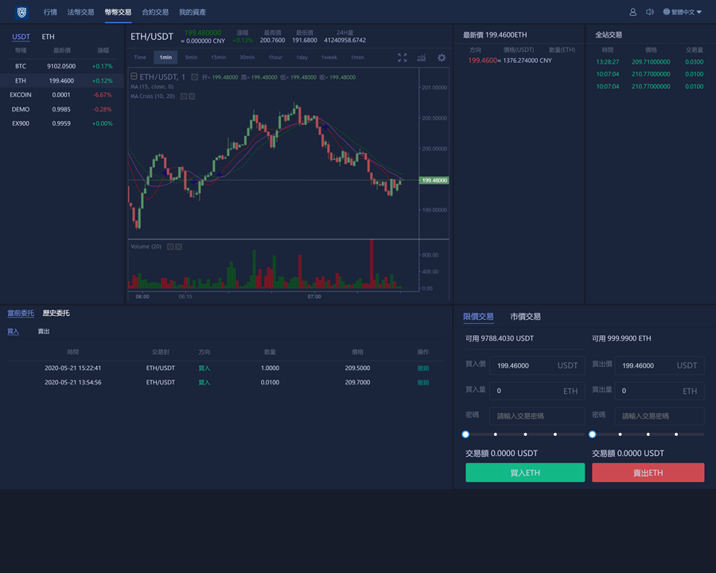
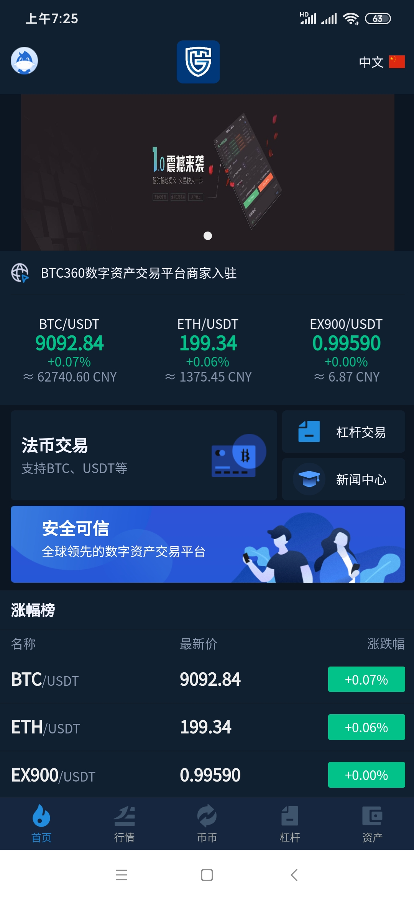
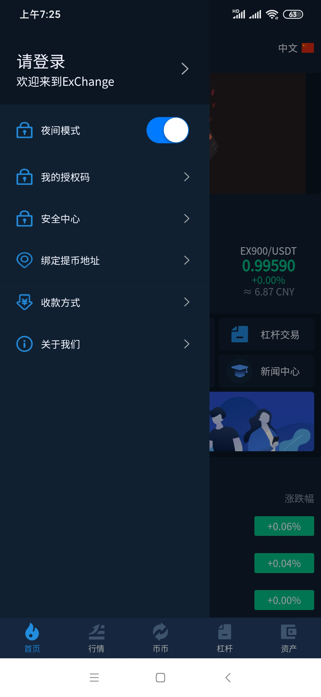
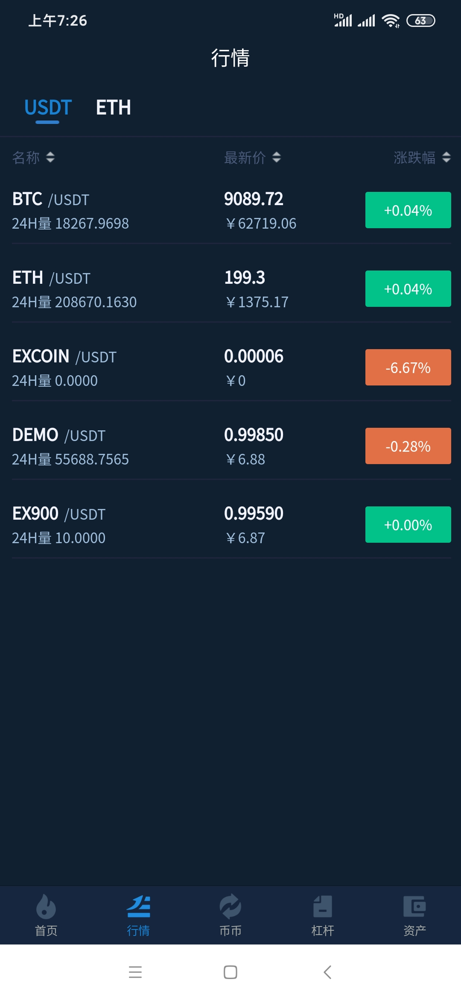
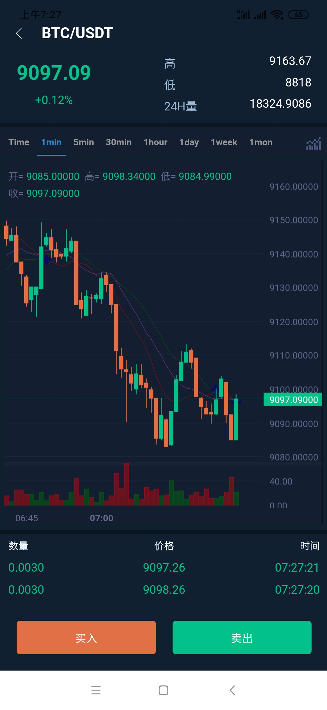
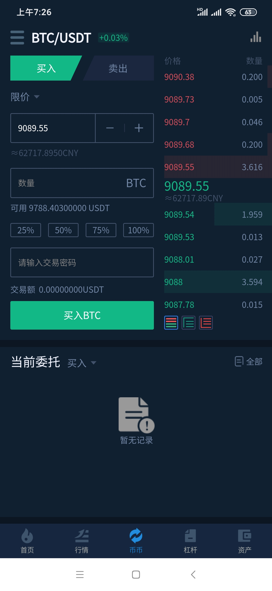
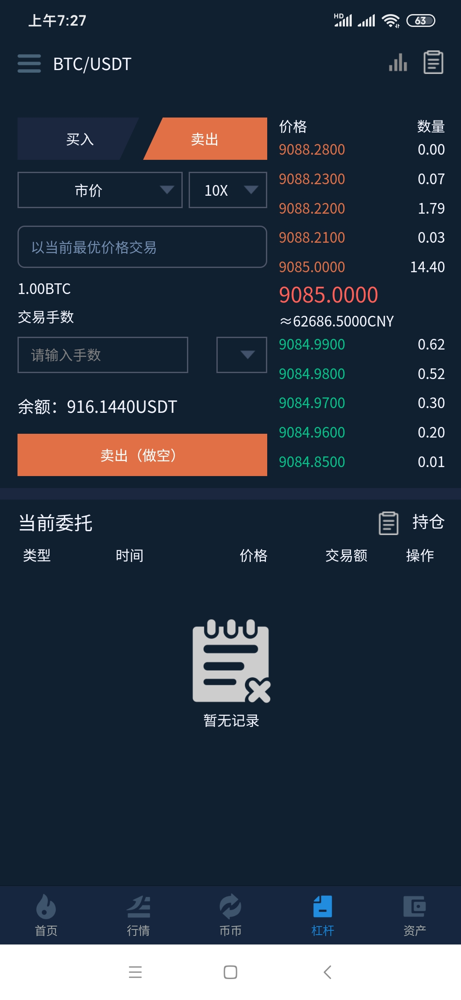
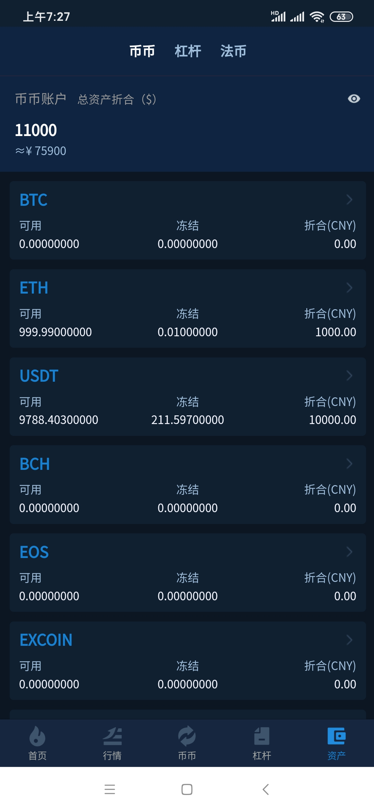
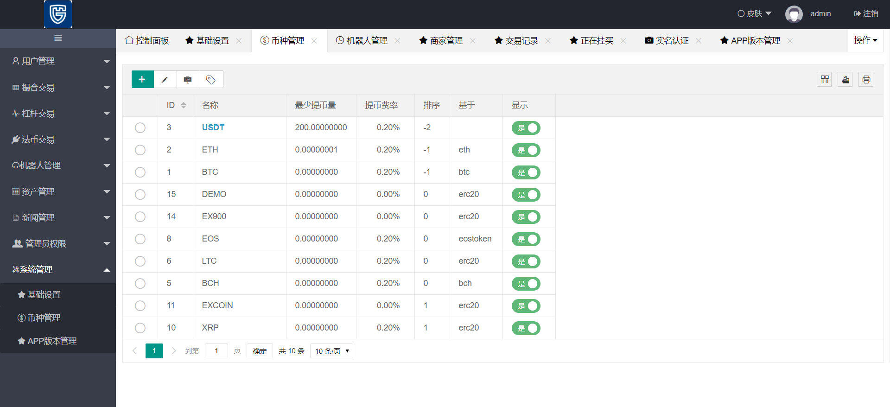

TG： https://t.me/isdapp

# 区块链交易所源码，法币，币币，合约，杠杆，机器人，java撮合，原生app钱包

功能技术列表：

1：前端：Vue、iView、less

2：后端：Laravel、swoole、opcache、readline、fileinfo

3：撮合引擎：java

4：机器人：java

5：数据库：Mysql、redis

6：数据引擎：elasticsearch+kibana

7：集群任务->supervisor

8：消息队列->Activemq

9：Laravel+vue交易所，专为加密货币交换而设计，性能可靠。

10：纯原生APP 移动端（IOS+Android）。

11：采用用elasticsearch，kibana和Redis集群分布式来实现系统的高效访问。

12：使用独立运行的JAVA撮合引擎，实现高效的交易撮合。

13：K线采用目前最专业的Trading View，和火币一样。

14：语言版本涵盖简体，繁体，日语，英语，多语种随意切换。

15：支持双层加密，通过两种不同的算法数据，来确保数据的“加密”存储，权限和控制。

16：无缝对接真实BTC，ETH, LTC，USDT，以及山寨钱包，安全采用多签名技术。

17:   支持币币交易

18:   支持OTC交易

19：全自动转入转出钱包功能。

20：对接火币大盘行情，全自动行情采集，自动刷新。

21：曲线自动产生，K线清晰易懂。

## 动画演示：

## Screenshots

全新升级日志
1：app端交易优化处理。

2：优化交易算法逻辑结构，撮合内核更简洁合理。

3：优化Trade交易界面，布局很合理。

4：优化手机端交易端页面。

5：模块完全采用Java内存处理队列,超级加快处理逻辑,中间不牵涉数据库操作,保证处理速度快,
     其中项目启动后采用继承AppListener方式，自动运行。
     
6：启动后自动加载未处理的订单,重新加载到JVM中，从而保证数据的准确，ex将订单处理后，
     将成交记录发送到市场。
7：运营完美版。

安全的交易所，安全防御如下：

1: 所有钱包端口修改成非常规端口。

2: 硬件防护（所有钱包放入内网机器，无任何外网权限，从而避免黑客调用api接口）。

3: 应用层防护,管理后台只允许内网访问,隔绝外网对钱包操作的高级权限。

4: 钱包key校验规则采用动态密码加静态混合模式，提高钱包自身的安全。

5: 外网采用sll级别的cdn加密加速处理，防止ip泄漏。

6: 应用钱包访问采用多认证（multisignature）在执行一项交易【预算会增加】。

7: 后台地址加key校验以及地址长度高度放大，增加强度。

8: 定期更改各种key和密码。

9: 为了一百的安全，建议定期把大额货币转入线下钱包，做到万无一失。

关于6应用钱包的认证的说明（multisignature）：

1: 本身钱包和服务器通信高强度user和pass密码（1层）。

2: 目前大部分交易所钱包为了方便通讯，没有做encrypt，目前可以通过encrypt手段加固钱包。

   交易所在通讯的时候，通过发送第二层密码，且设置会话超短时间，会话结束后自动
   
   锁定钱包，从而让钱包达到更安全（2层）
   

# 声明

1. 使用本系统方必须在国家相关法律法规范围内并经过国家相关部门的授权许可，禁止用于一切非法行为。

2. 本系统限于测试、实验、研究为目的，禁止用于一切商业运营，本团队不承担使用者在使用过程中的任何违法行为负责。

3. 源码以演示站为准。

